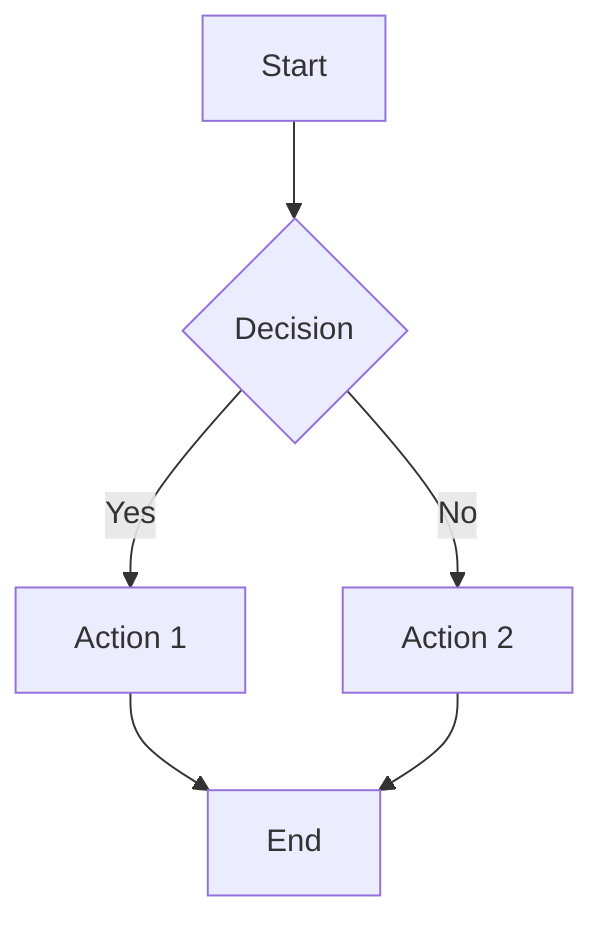
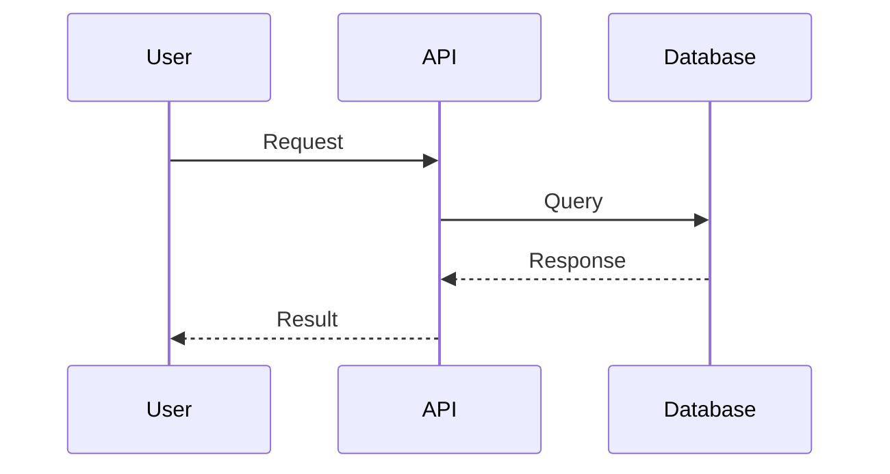
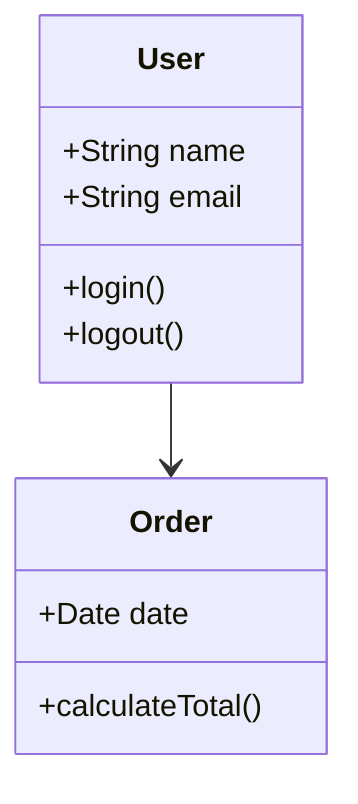

# Mermaid MCP Server

**URL**: `https://config.superbots.link/mcp/mermaid/*`  
**Version**: `1.0.0`

**Reference**: [mcp-mermaid GitHub](https://github.com/hustcc/mcp-mermaid)

---

## Overview

The Mermaid MCP (Model Context Protocol) server provides a standardized interface for AI agents to generate and work with Mermaid diagrams. It implements the MCP protocol specification, enabling seamless integration with AI tools like Claude Desktop, Cursor, and VS Code.

Mermaid is a diagramming and charting tool that uses text-based syntax to create diagrams. This MCP server allows AI agents to generate, validate, and render Mermaid diagrams.

---

## Features

- ✅ **MCP Protocol Compliance**: Full implementation of MCP protocol endpoints
- ✅ **Diagram Generation**: Generate Mermaid code from natural language descriptions
- ✅ **Code Validation**: Validate Mermaid syntax
- ✅ **Rendering Support**: Provide rendering instructions and URLs
- ✅ **Multiple Diagram Types**: Support for flowcharts, sequence diagrams, class diagrams, and more
- ✅ **SSE Streaming**: Server-Sent Events support for real-time updates
- ✅ **CORS Support**: Full CORS headers for cross-origin access

---

## API Endpoints

### Initialize MCP Connection

```http
POST /mcp/mermaid/initialize
```

Initialize the MCP server connection and get server capabilities.

**Response**:
```json
{
  "success": true,
  "data": {
    "name": "mermaid-mcp-server",
    "version": "1.0.0",
    "protocolVersion": "2024-11-05",
    "capabilities": {
      "tools": { "listChanged": true },
      "resources": { "subscribe": true, "listChanged": true },
      "prompts": { "listChanged": true }
    }
  }
}
```

---

### List Available Tools

```http
GET /mcp/mermaid/tools/list
```

Get a list of all available MCP tools (Mermaid operations).

**Available Tools**:
1. **`mermaid_render`** - Render Mermaid diagram code to SVG or PNG
2. **`mermaid_validate`** - Validate Mermaid diagram code syntax
3. **`mermaid_generate`** - Generate Mermaid diagram code from description

---

### Call a Tool

```http
POST /mcp/mermaid/tools/call
Content-Type: application/json

{
  "name": "mermaid_generate",
  "arguments": {
    "description": "A flowchart showing user login process",
    "diagram_type": "flowchart"
  }
}
```

**Example: Generate Diagram**:
```bash
curl -X POST "https://config.superbots.link/mcp/mermaid/tools/call" \
  -H "Content-Type: application/json" \
  -d '{
    "name": "mermaid_generate",
    "arguments": {
      "description": "A flowchart showing user login process with validation",
      "diagram_type": "flowchart"
    }
  }'
```

**Example: Validate Code**:
```bash
curl -X POST "https://config.superbots.link/mcp/mermaid/tools/call" \
  -H "Content-Type: application/json" \
  -d '{
    "name": "mermaid_validate",
    "arguments": {
      "code": "graph TD\n    A[Start] --> B[Process]"
    }
  }'
```

**Example: Render Diagram**:
```bash
curl -X POST "https://config.superbots.link/mcp/mermaid/tools/call" \
  -H "Content-Type: application/json" \
  -d '{
    "name": "mermaid_render",
    "arguments": {
      "code": "graph TD\n    A[Start] --> B[End]",
      "format": "svg",
      "theme": "default"
    }
  }'
```

---

## Tool Reference

### mermaid_generate

Generate Mermaid diagram code from a natural language description.

**Arguments**:
- `description` (required): Natural language description of the diagram
- `diagram_type` (optional): Type of diagram (flowchart, sequence, class, state, er, gantt, pie, gitgraph, journey, c4, mindmap, timeline)
  - Default: `flowchart`

**Example**:
```json
{
  "name": "mermaid_generate",
  "arguments": {
    "description": "A sequence diagram showing API request flow",
    "diagram_type": "sequence"
  }
}
```

**Supported Diagram Types**:
- `flowchart` - Flowcharts and graphs
- `sequence` - Sequence diagrams
- `class` - Class diagrams
- `state` - State diagrams
- `er` - Entity-relationship diagrams
- `gantt` - Gantt charts
- `pie` - Pie charts
- `gitgraph` - Git graphs
- `journey` - User journeys
- `c4` - C4 diagrams
- `mindmap` - Mind maps
- `timeline` - Timelines

---

### mermaid_validate

Validate Mermaid diagram code syntax without rendering.

**Arguments**:
- `code` (required): Mermaid diagram code to validate

**Example**:
```json
{
  "name": "mermaid_validate",
  "arguments": {
    "code": "graph TD\n    A[Start] --> B[End]"
  }
}
```

**Response**:
```json
{
  "valid": true,
  "code": "...",
  "checks": {
    "hasDiagramType": true,
    "hasBasicSyntax": true
  }
}
```

---

### mermaid_render

Render Mermaid diagram code to SVG or PNG format.

**Arguments**:
- `code` (required): Mermaid diagram code
- `format` (optional): Output format (`svg` or `png`), default: `svg`
- `theme` (optional): Mermaid theme (`default`, `dark`, `forest`, `neutral`), default: `default`
- `backgroundColor` (optional): Background color (hex code), default: `transparent`

**Example**:
```json
{
  "name": "mermaid_render",
  "arguments": {
    "code": "graph TD\n    A[Start] --> B[End]",
    "format": "svg",
    "theme": "default"
  }
}
```

**Response**:
```json
{
  "code": "...",
  "format": "svg",
  "rendering": {
    "method": "Use one of the following methods to render:",
    "options": [
      {
        "name": "Mermaid Live Editor",
        "url": "https://mermaid.live/edit#pako:...",
        "description": "Paste code and view rendered diagram"
      },
      {
        "name": "Mermaid.js Client-side",
        "url": "https://mermaid.js.org/",
        "description": "Use Mermaid.js library to render in browser"
      },
      {
        "name": "Mermaid.ink API",
        "url": "https://mermaid.ink/",
        "description": "Use mermaid.ink API (requires base64 encoding)"
      }
    ]
  }
}
```

**Note**: Actual rendering is done client-side or via external services. The server provides the code and rendering instructions.

---

## Integration with AI Tools

### Cursor

Already configured in `.cursor/mcp.json`:

```json
{
  "mcpServers": {
    "mermaid": {
      "url": "https://config.superbots.link/mcp/mermaid/sse",
      "transport": "sse",
      "description": "Mermaid MCP Server - Generate and render Mermaid diagrams"
    }
  }
}
```

### Claude Desktop

Add to `claude_desktop_config.json`:

```json
{
  "mcpServers": {
    "mermaid": {
      "url": "https://config.superbots.link/mcp/mermaid/sse",
      "transport": "sse"
    }
  }
}
```

### VS Code with GitHub Copilot

Add to `.vscode/mcp.json`:

```json
{
  "mcpServers": {
    "mermaid": {
      "url": "https://config.superbots.link/mcp/mermaid/sse",
      "transport": "sse"
    }
  }
}
```

---

## Usage Examples

### Example 1: Generate Flowchart

```
Use mermaid_generate to create a flowchart showing the user registration process
```

### Example 2: Generate Sequence Diagram

```
Use mermaid_generate with diagram_type "sequence" to show how an API request flows through the system
```

### Example 3: Validate and Render

```
Use mermaid_validate to check this Mermaid code, then use mermaid_render to get rendering instructions
```

### Example 4: Create Class Diagram

```
Use mermaid_generate to create a class diagram showing the relationship between User, Order, and Product classes
```

---

## Rendering Options

The MCP server provides multiple rendering options:

### 1. Mermaid Live Editor (Recommended)

**URL**: `https://mermaid.live/`

Paste your Mermaid code directly into the editor to view and edit diagrams.

**Advantages**:
- No setup required
- Interactive editing
- Export to SVG/PNG
- Shareable links

### 2. Mermaid.js Client-side

**URL**: `https://mermaid.js.org/`

Use the Mermaid.js library in your web application:

```html
<script src="https://cdn.jsdelivr.net/npm/mermaid/dist/mermaid.min.js"></script>
<script>
  mermaid.initialize({ startOnLoad: true });
</script>
<div class="mermaid">
  graph TD
    A[Start] --> B[End]
</div>
```

### 3. Mermaid.ink API

**URL**: `https://mermaid.ink/`

Use the mermaid.ink API for server-side rendering:

```
https://mermaid.ink/svg/{base64EncodedMermaid}
https://mermaid.ink/img/{base64EncodedMermaid}
```

**Example**:
```javascript
const code = "graph TD\n    A[Start] --> B[End]";
const base64 = btoa(code);
const url = `https://mermaid.ink/svg/${base64}`;
```

---

## Mermaid Syntax Examples

### Flowchart



### Sequence Diagram



### Class Diagram



---

## Error Handling

All errors include `aiGuidance` for AI agents:

```json
{
  "success": false,
  "error": {
    "message": "Bad Request",
    "code": "INVALID_ARGUMENTS",
    "aiGuidance": {
      "issue": "Missing required argument: code",
      "solution": "Provide the code parameter",
      "example": {
        "name": "mermaid_validate",
        "arguments": {
          "code": "graph TD\n    A --> B"
        }
      }
    }
  }
}
```

---

## Architecture

```
┌─────────────────────────────────────────┐
│         AI Agent (Claude/Cursor)        │
└──────────────┬──────────────────────────┘
               │ MCP Protocol
               │ (SSE/HTTP)
               ▼
┌─────────────────────────────────────────┐
│    Mermaid MCP Server (Cloudflare)      │
│    config.superbots.link/mcp/mermaid     │
└──────────────┬──────────────────────────┘
               │
               └──► Mermaid Code Generation
                    Rendering Instructions
                    External Services
                    (mermaid.live, mermaid.ink)
```

---

## Testing

Test the MCP server:

```bash
# Initialize
curl -X POST "https://config.superbots.link/mcp/mermaid/initialize"

# List tools
curl -X GET "https://config.superbots.link/mcp/mermaid/tools/list"

# Generate diagram
curl -X POST "https://config.superbots.link/mcp/mermaid/tools/call" \
  -H "Content-Type: application/json" \
  -d '{"name":"mermaid_generate","arguments":{"description":"A simple flowchart","diagram_type":"flowchart"}}'

# Validate code
curl -X POST "https://config.superbots.link/mcp/mermaid/tools/call" \
  -H "Content-Type: application/json" \
  -d '{"name":"mermaid_validate","arguments":{"code":"graph TD\n    A --> B"}}'
```

---

## References

- [mcp-mermaid GitHub](https://github.com/hustcc/mcp-mermaid)
- [Mermaid Documentation](https://mermaid.js.org/)
- [Mermaid Live Editor](https://mermaid.live/)
- [Mermaid.ink API](https://mermaid.ink/)
- [Model Context Protocol Specification](https://modelcontextprotocol.io)

---

## Status

✅ **Deployed**: Production  
✅ **Tested**: Basic endpoints verified  
✅ **Documentation**: Complete  
✅ **Integration**: Ready for AI tools

---

## Limitations

- **Rendering**: Actual diagram rendering is done client-side or via external services (mermaid.live, mermaid.ink)
- **Base64 Encoding**: Cloudflare Workers don't have native `btoa`, so base64 encoding for mermaid.ink should be done client-side
- **Code Generation**: Current implementation uses template-based generation. For better results, consider integrating with an LLM

---

## Future Enhancements

- [ ] Integrate LLM for better code generation
- [ ] Add server-side rendering using Mermaid.js WASM
- [ ] Support for more diagram types
- [ ] Diagram editing and modification tools
- [ ] Export to multiple formats (PDF, PNG, SVG)

